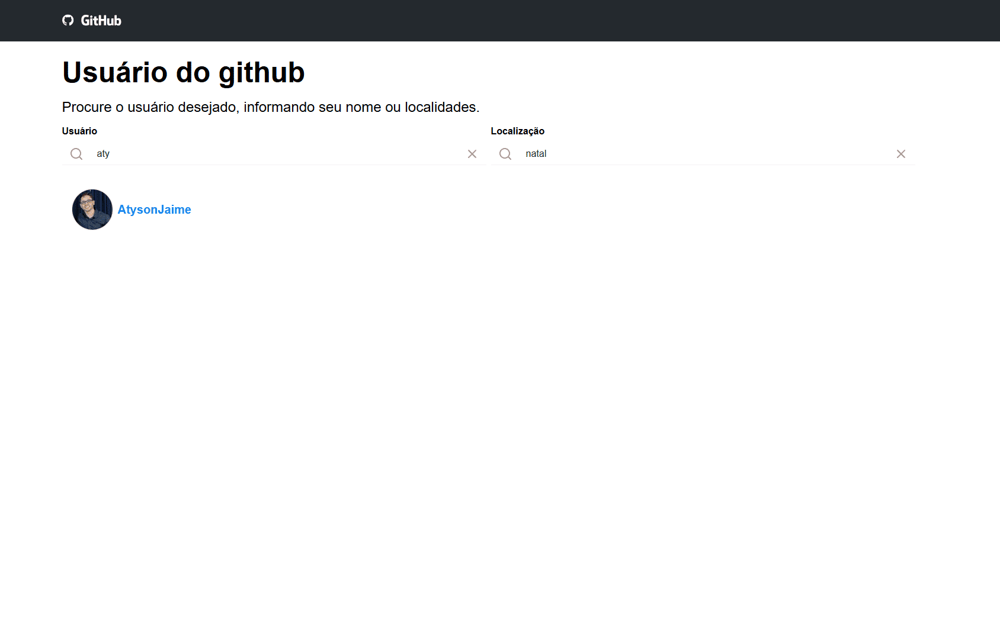
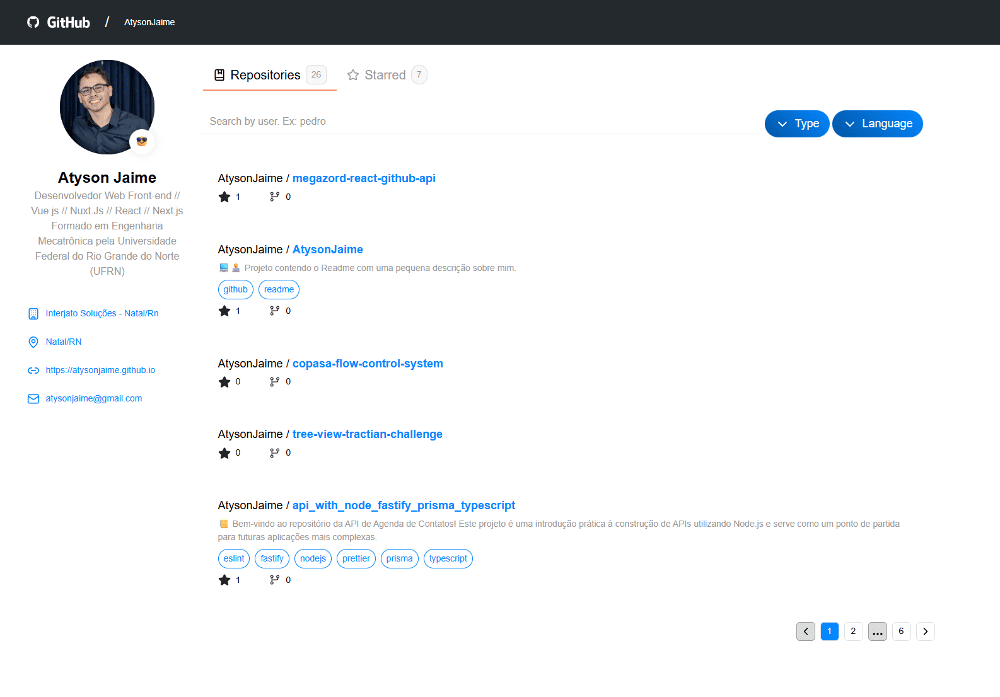

# Megazord React GitHub API


> 📑 O presente repositório tem como objetivo o desenvolvimento de uma aplicação web para consumo de dados da API REST do GitHub.
> Neste projeto você verá a listagem de usuários com filtros por nome e localização. Além disso, ao acessar um usuário, você terá a listagem de seus repositórios e suas informações básicas.
>
> Desafio desenvolvido para a empresa Megazord, com o intuito de mostrar minhas habilidades e conhecimentos em React.
> Todo o design da tela de usuário, teve como base o seguinte [Figma](https://www.figma.com/design/sf1CmqcEZbUzkeZOA4AUGj/TESTE-FRONT-MAGAZORD?node-id=2-478&t=LwjrW6B6j04oD5kY-0).
>
> Caso deseje visualizar o projeto rodando, acesso a página da vercel no link: [Ver Projeto](https://megazord-react-github-api.vercel.app/)

## 📚 Sobre o projeto

- A aplicação é responsiva, ou seja, funciona em diferentes tamanhos de tela.
- Outrossim, realizei algumas alterações no design original do Figma, ao qual, julguei interessante realizar, como por exemplo:
  - Adicionei a tela de listagem de usuários;
  - Adicionei mais informações nos cards de repositório;
  - Mantive o filtro de nome de repositório no mobile;
  - Mesclei os ícones entre o React-Icons e o Lucide, porém estão de acordo com o Design proposto.

### Organização de pastas

O projeto segue boas práticas de organização, princípios de Clean Code e padronização estrutural, visando escalabilidade e facilidade de manutenção. A estrutura adotada foi a seguinte:

```bash
src/
├── app/
├── assets/
├── components/
├── interfaces/
├── stores/
├── utils/
└── server.ts
```

#### app/

> Contém as rotas e páginas da aplicação, seguindo o padrão do Next.js App Router. É responsável pela composição das telas e orquestração dos componentes de domínio.

#### assets/

> Reúne arquivos estáticos do projeto, como imagens, ícones e estilos globais, garantindo centralização dos recursos visuais.

#### components/

> Contém os componentes reutilizáveis da aplicação, como Header, Aside, cards e demais elementos de interface.
> A separação foi feita visando reuso, baixo acoplamento e responsabilidade única.

#### interfaces/

> Centraliza as tipagens TypeScript utilizadas no projeto, como retornos da API, props de componentes e entre outros.
> Essa abordagem garante maior segurança, previsibilidade e padronização no desenvolvimento.

#### stores/

> Agrupa os estados globais gerenciados pelo Zustand, responsáveis por compartilhar informações entre diferentes partes da aplicação de forma simples e performática.

#### utils/

> Contém funções utilitárias, helpers e constantes reutilizáveis, evitando duplicação de lógica e facilitando a manutenção.

#### server.ts

> Responsável pela camada de comunicação com a API do GitHub.
> Centraliza a configuração do Octokit e as funções de consumo de dados, isolando regras de integração e facilitando evolução futura.

### Telas

- Esse projeto possui duas telas, a tela de listagem de usuários e a tela de detalhes de um usuário.

> [!NOTE]
> Para voltar da tela de detalhamento de um usuário para a tela de listagem, basta clicar na logo do GitHub localizada no canto superior esquerdo.

#### Tela de listagem de usuários



- Nesta tela, você verá a listagem de usuários permitindo filtra-los pelo nome ou localização.

> [!NOTE]
> A listagem é carregada apenas após a realização de uma busca, evitando consumo desnecessário da API e respeitando os limites de rate do GitHub.

#### Tela de detalhes de um usuário



- Nesta tela, você verá a listagem de repositórios do usuário selecionado, como também, informações básicas.
- Além disso, clicando na tab Starred, você verá a listagem de repositórios favoritos.
- Outra funcionalidade é a possibilidade de filtros, como: Nome, Linguagens e Tipos.

### Desafios técnicos enfrentados

#### 1. Integração com a API do GitHub via Octokit.js

O primeiro desafio encontrado foi a integração com a API do GitHub utilizando o Octokit.js, biblioteca oficial recomendada para requisições em JavaScript/TypeScript.

- Como meu fluxo habitual de consumo de APIs é baseado no Axios, foi necessário um período de estudo para compreender a arquitetura, padrões e abstrações do Octokit.
- Além disso, precisei investigar com maior profundidade o comportamento das rotas disponíveis, suas restrições de parâmetros, formatos de resposta e, principalmente, o funcionamento da paginação e dos limites impostos pela API.
- Esse processo exigiu leitura de documentação, testes exploratórios e validações para garantir uma implementação estável e alinhada às boas práticas recomendadas pelo próprio GitHub.

#### 2. Gerenciamento de estado e cache com React Query

Outro ponto desafiador foi a adoção do React Query para gerenciamento de cache e sincronização dos dados provenientes da API.

- Embora já tivesse contato prévio com a biblioteca, não possuía domínio aprofundado de seus conceitos, como invalidação de cache, estratégias de refetch e controle de reatividade.
- Encarei esse cenário como uma oportunidade de aprendizado, buscando compreender o fluxo completo de atualização de dados a partir de mudanças de filtros e paginação.

## 👨‍💻 Tecnologias

| Nome            | Site                                        |
| --------------- | ------------------------------------------- |
| Next.js         | <https://nextjs.org>                        |
| React           | <https://reactjs.org>                       |
| TypeScript      | <https://www.typescriptlang.org>            |
| Tailwind CSS    | <https://tailwindcss.com>                   |
| Zustand         | <https://zustand-demo.pmnd.rs>              |
| ECharts         | <https://echarts.apache.org>                |
| Prettier        | <https://prettier.io>                       |
| React Query     | <https://tanstack.com/query/latest>         |
| Lucide          | <https://lucide.dev>                        |
| React Bootstrap | <https://react-bootstrap.github.io>         |
| React Icons     | <https://react-icons.github.io/react-icons> |

## 🚀 Getting Started

### Pré-requisitos

- Node.js >= 22.0.0
- npm, yarn, pnpm ou bun

### Instalação

#### 1. Clone o repositório

Close o repositório em sua maquina na pasta que desejar.

```bash
git clone <url-do-repositorio>
cd megazord-react-github-api
```

#### 2. Instale as dependências

Ao acessar a pasta do projeto, instale as dependências utilizando o gerenciador a sua escolha.

```bash
npm install
# ou
yarn install
# ou
pnpm install
# ou
bun install
```

> [!NOTE]
> No meu caso, utilize o pnpm. Pois, em comparação com o npm ele é mais eficiente.

#### 3. Configuração do token de acesso a API do GITHUB

Para acessar todas as funcionalidades do projeto, é necessário criar um token de acesso a API do GITHUB. Para tal, siga os passos abaixo:

1. Crie um arquivo .env na raiz do projeto, seguindo o exemplo do arquivo env.exemplo
2. Acesse a página de tokens do GITHUB: [https://github.com/settings/tokens](https://github.com/settings/tokens)
3. Clique no botão "Generate new token"
4. Feito isso, siga os passos do formulário que irá surgir.
5. Após o token ser gerado, copie ele e cole no arquivo .env na variável NEXT_PUBLIC_GITHUB_TOKEN.

#### 4. Inicie o projeto

Após todas as etapas acima finalizadas, inicie o projeto utilizando o gerenciador a sua escolha.

```bash
npm run dev
# ou
yarn dev
# ou
pnpm dev
# ou
bun dev
```

## 📝 Licença

[MIT License](https://github.com/AtysonJaime/megazord-react-github-api/blob/main/LICENSE) © [Atyson Jaime](https://atysonjaime.github.io)
